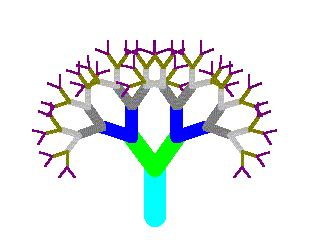
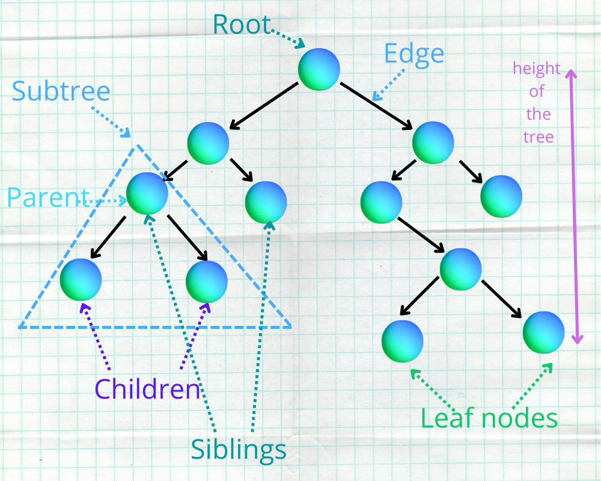
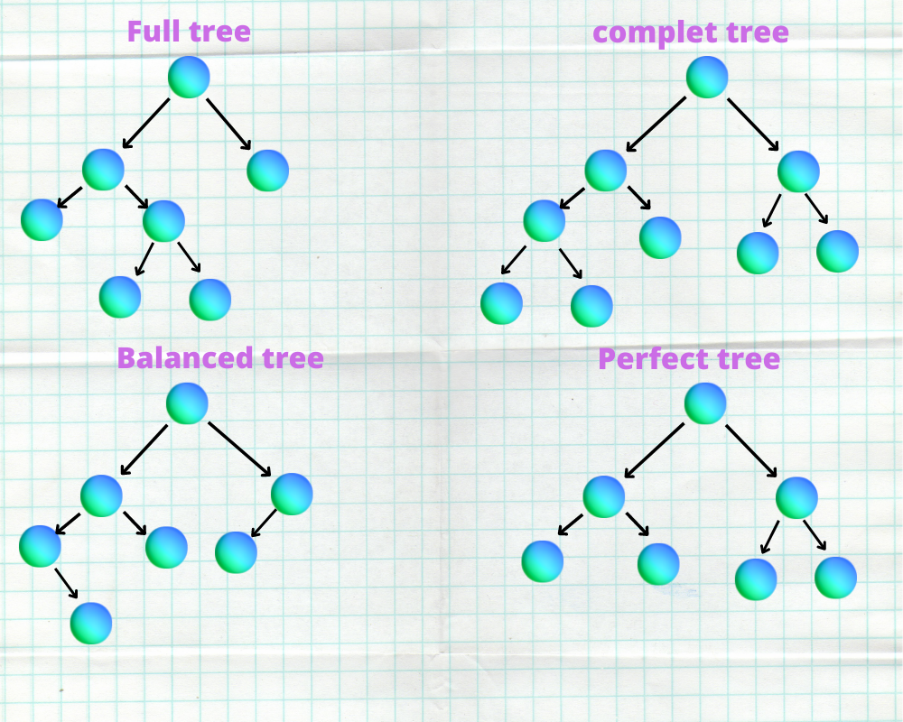
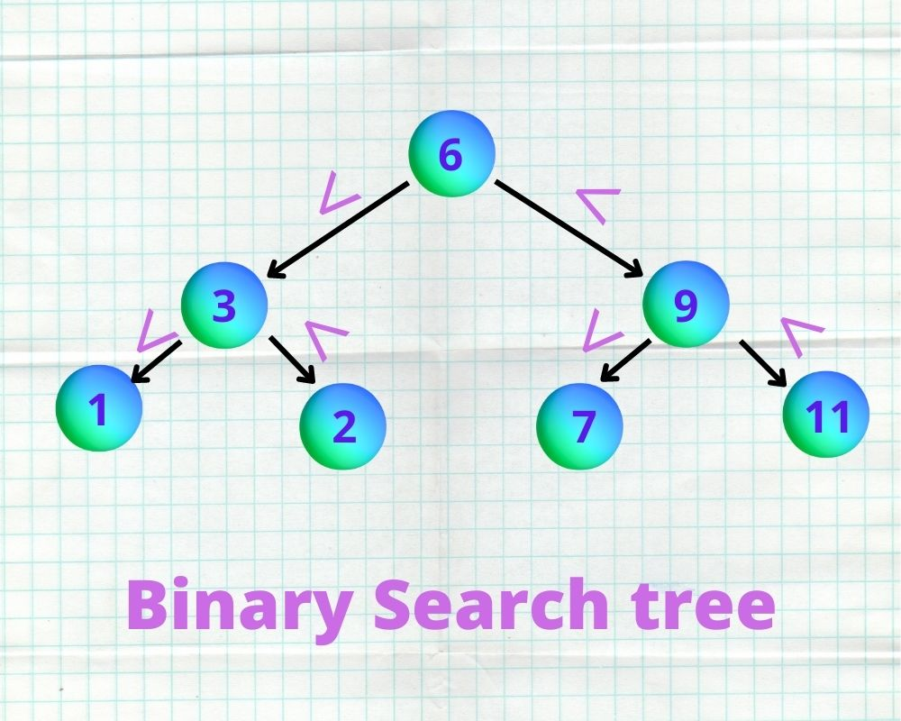

<h1 align="center">
	✏️ C - binary tree
</h1>
<p align="center">
	<b><i>HOLBERTON SCHOOL BINARY TREE</i></b><br>
</p>
<p align="center">
	

</p>
<h3 align="center">
	<a href="##Description">Description</a>
	<span> · </span>
	<a href="##Important Terms">Important Terms</a>
	<span> · </span>
	<a href="### 🖥 type of trees:">Types Of binary trees</a>

</h3>

---

## 💡 a binary tree:
In our Holberton school group project pair programing we work on and understanding `A BINARY TREE`,

## 📝 Description: 

`a binary tree`  is a tree data structure where each node has up to two child nodes, creating the branches of the tree. The two children are usually called the left and right nodes. Parent nodes are nodes with children, while child nodes may include references to their parents.
<p algin="center">
	
</p>


## 📝 Important Terms:
 
#### Root:
The node at the top of the tree is called root. There is only one root per tree and one path from the root node to any node.
#### Parent:
Any node except the root node has one edge upward to a node called parent.
#### Child: 
The node below a given node connected by its edge downward is called its child node.
#### Grandparents:  
A grandparent of a node is the parent of its parent.
#### Uncle:
 The child of grandparents
#### Cousins:
The child of uncle if it exists.

#### Siblings:
Nodes with the same parent.

#### Leaf:
The node which does not have any child node is called the leaf node.
```
hana@hana-Vostro-3500:~/holbertonschool-binary_trees$ ./12-leaves 
  .-------(098)--.
(012)--.       (128)--.
     (054)          (402)
Leaves in 98: 2
Leaves in 128: 1
Leaves in 54: 1
```

#### Subtree:

It is defined as the tree that is a direct descendant of a node. Take note that the term highlights the fact that anything that is a descendant of a tree node is itself a tree, as well as a subset of the bigger tree, which is referred to as the root node.

#### Depth of the node:
The `depth` of a node is the number of edges present in path from the root node of a tree to that node.
```
hana@hana-Vostro-3500:~/holbertonschool-binary_trees$ ./10-depth 
  .-------(098)--.
(012)--.       (128)--.
     (054)          (402)
Depth of 98: 0
Depth of 128: 1
Depth of 54: 2
```
#### Height of the node:
The `height` of a node is the number of edges present in the longest path connecting that node to a leaf node.

```
alex@/tmp/binary_trees$ ./9-height 
  .-------(098)--.
(012)--.       (128)--.
     (054)          (402)
Height from 98: 2
Height from 128: 1
Height from 54: 0
```
 
#### Edge: 
Connection between one node to another.


### 🖥 type of trees:
 <p algin="center">
	
</p>

#### Binary tree is full:
is a tree in which every node has either 0 or 2 children.

```
hana@hana-Vostro-3500:~/holbertonschool-binary_trees$ ./15-full 
       .-------(098)--.
  .--(012)--.       (128)--.
(010)     (054)          (402)
Is 98 full: 0
Is 12 full: 1
Is 128 full: 0

```


#### Binary tree is perfect 

is a binary tree in which all interior nodes have two children and all leaves have the same depth or same level.
```
hana@hana-Vostro-3500:~/holbertonschool-binary_trees$ ./16-perfect
       .-------(098)-------.
  .--(012)--.         .--(128)--.
(010)     (054)     (010)     (402)
Perfect: 1

       .-------(098)-------.
  .--(012)--.         .--(128)-------.
(010)     (054)     (010)       .--(402)
                              (010)
Perfect: 0

       .-------(098)-------.
  .--(012)--.         .--(128)-------.
(010)     (054)     (010)       .--(402)--.
                              (010)     (010)
Perfect: 0

```

#### Binary tree is complete 
is a binary tree in which every level, except possibly the last, is comilled, and all nodes in the last level are as far left as possible.
#### Binary tree is balanced 
is a binary tree structure in which the left and right subtrees of every node differ in height by no more than 1
```
hana@hana-Vostro-3500:~/holbertonschool-binary_trees$ ./16-perfect 
       .-------(098)-------.
  .--(012)--.         .--(128)--.
(010)     (054)     (010)     (402)
Perfect: 1

       .-------(098)-------.
  .--(012)--.         .--(128)-------.
(010)     (054)     (010)       .--(402)
                              (010)
Perfect: 0

       .-------(098)-------.
  .--(012)--.         .--(128)-------.
(010)     (054)     (010)       .--(402)--.
                              (010)     (010)
Perfect: 0

```
I
#### Binary Search Tree: 
<p algin="center">
	
</p>

A binary Search Tree is a node-based binary tree data structure which has the following properties: The left subtree of a node contains only nodes with keys lesser than the node's key. The right subtree of a node contains only nodes with keys greater than the node's key.

## 📂  What our file stand for:

| file                       :|  What our file stand for		        	    |
|---------------------------- |:---------------------------------------------:  |
|0-binary_tree_node.c         |a function that creates a binary tree            |
|1-binary_tree_insert_left.c  |a function that inserts a node as the left-child of another node	   |		                                                                             
|2-binary_tree_insert_right.c | a function that inserts a node as the right-child of another node  |	                                        
|3-binary_tree_delete.c		  |	a function that deletes an entire binary tree		               |
|4-binary_tree_is_leaf.c	  | a function that checks if a node is a leaf	                       |                    
|5-binary_tree_is_root.c	  |a function that checks if a given node is a root				       |
|6-binary_tree_preorder.c	  |a function that goes through a binary tree using pre-order traversal|
|7-binary_tree_inorder.c	  |a function that goes through a binary tree using in-order traversal  |
|8-binary_tree_postorder.c	  |a function that goes through a binary tree using post-order traversal|	
|9-binary_tree_height.c		  |a function that measures the height of a binary tree|
|10-binary_tree_depth.c		  |a function that measures the depth of a node in a binary tree		  |	
|11-binary_tree_size.c		  |a function that measures the size of a binary tree					  |	
|12-binary_tree_leaves.c 	  |Stringa function that counts the leaves in a binary tree				  |
|13-binary_tree_nodes.c		  |a function that counts the nodes with at least 1 child in a binary tree|			
|14-binary_tree_balance.c	  |a function that measures the balance factor of a binary tree			  |				
|15-binary_tree_is_full.c	  |a function that checks if a binary tree is full                   	  |	    
|16-binary_tree_is_perfect.c  |a function that checks if a binary tree is perfect					  | 
|17-binary_tree_sibling.c     |a function that finds the sibling of a node			                  |		
|18-binary_tree_uncle.c       |a function that finds the uncle of a node		                      |    		
|Binary_trees.h		          |header file                                                            |				
|Function.c		              |binary_tree_print.c 			                                          |     		
 
## :octocat: Authors:
* [aya aribi](https://github.com/ayaaribi123)
* [Hana Ouerghemmi](https://github.com/HanaOuerghemmi)
 
